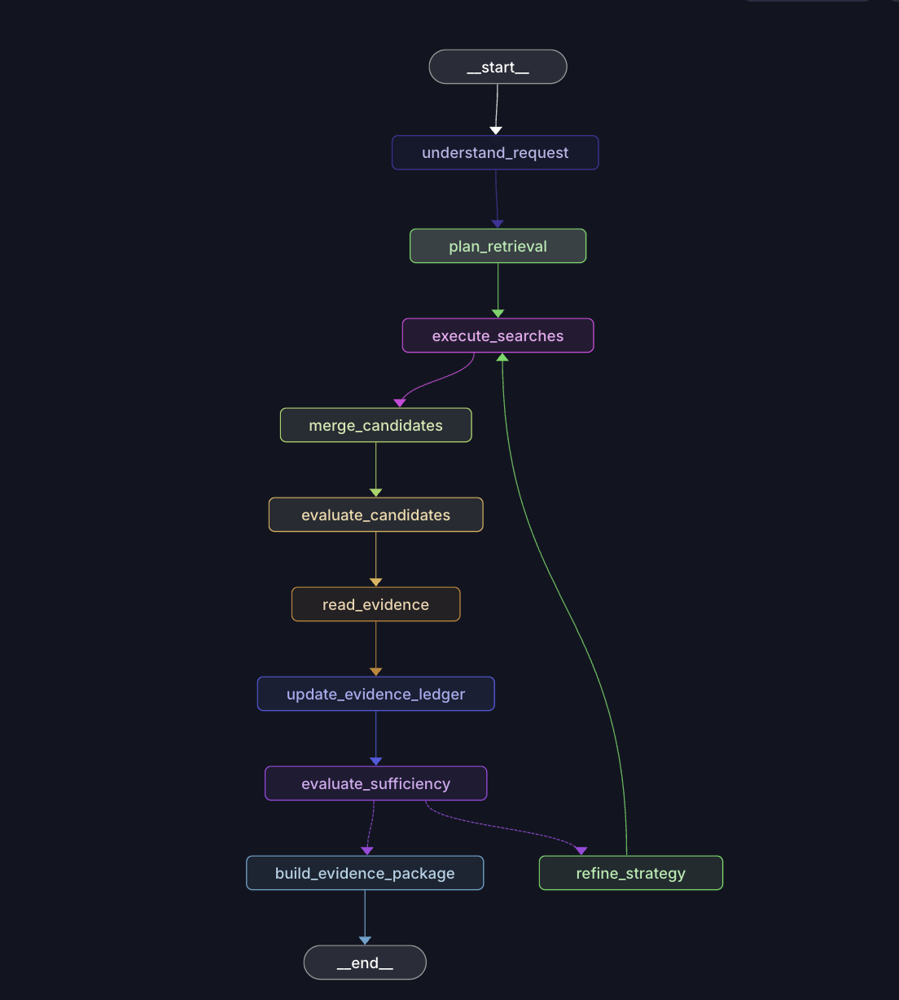

# longdoc-retrieval

Retrieval for long, structurally complex documents, without embeddings and
without ever putting the full document in an LLM prompt.

## The problem

Long documents (contracts, administrative records, government filings)
don't fit in a prompt, and embeddings aren't always an option or the best
fit for what should be exact retrieval - a specific clause, a specific
number, a specific defined term. This project answers a narrower question:
given a long document and a question about it, how do you find the
supporting evidence deterministically and cheaply, and only bring in an LLM
to decide *what to look for next* and *whether what's been found is
enough* - never to hold the whole document in its head.

## How it works

Two layers, stacked.

### 1. Deterministic retrieval

`domain/`, `ingestion/`, `indexes/`, `retrieval/`, `api/` — no LLM on this path. A document is
normalized and parsed into a structural tree (headings/sections, bilingual
EN/PT-BR detection - ARTICLE/SECTION as well as ARTIGO/SEÇÃO/CAPÍTULO -
falling back to normalized blocks when no structure is detectable), then
chunked into 150-400 token retrieval units along paragraph boundaries -
the unit that actually gets indexed. Two indexes sit on top: a BM25 sparse
index (SQLite FTS5 by default, Tantivy as a drop-in alternative - see
below) for natural-language queries, and a direct regex scan for
identifiers (dates, money, statute references, tax IDs, contract numbers) -
lexical ranking doesn't apply to something that either matches exactly or
doesn't. `RetrievalService` exposes exactly 7 methods over this:
`document_outline`, `search`, `find_exact`, `inspect_node`, `expand_node`,
`read_node`, `read_range` - none of them return the full document by
default.

### 2. Agentic retrieval loop



Given `(document_id, question)`, the `graph/` layer — built on
[LangGraph](https://github.com/langchain-ai/langgraph) — runs a compiled
state graph through this sequence, looping back to `execute_searches`
when one pass isn't enough:

| Node | LLM calls | What it does |
|---|---|---|
| `understand_request` | 0 | Fetches a depth-2 `document_outline` and renders it as an indented title tree - the only view of document structure the planner gets, never the full text. |
| `plan_retrieval` | 1 | Turns the question (+ outline, + what the previous iteration said was missing) into a `RetrievalPlan`: an objective, lexical `concepts`, `exact_terms` for identifier search, `structural_hints`, and a `queries` list. On a failed/invalid structured-output call, falls back to an empty plan rather than crashing or inventing one - the next node simply finds nothing, and sufficiency correctly reports it's missing information. |
| `execute_searches` | 0 | Concatenates `queries` + `concepts` (both sparse) + `exact_terms` (exact) *in that order*, dedupes by (method, query), truncates to `max_queries_per_iteration`, then runs everything concurrently via `asyncio.gather`. Because `queries` comes first, a plan with more `queries` than the budget allows can crowd out `concepts`/`exact_terms` entirely for that iteration. |
| `merge_candidates` | 0 | Dedupes by `candidate_id`, merges overlapping ranges within the same node (exact > structural > sparse > expanded wins on conflict), then buckets by top-level section and round-robins across buckets (sorted by lexical score within each) up to `max_candidates_for_llm_evaluation` - so ten hits from one paragraph don't crowd out other relevant sections. |
| `evaluate_candidates` | 1 (batched) | One call judges *all* fused candidates at once from short previews, never full text. If the model omits a candidate from its response, that one is backfilled as `possibly_relevant/should_read=false` rather than silently dropped; if the whole call fails, every candidate defaults to `should_read=true` - a flaky evaluator degrades cost/breadth, never correctness. |
| `read_evidence` → `update_evidence_ledger` | 0 | Opens only `should_read=true` candidates in full via `read_range`. The ledger merges a new item into an existing one only when the join point looks like a genuine mid-sentence cut (no closing punctuation right before it) - not just because two retrieval units happen to be adjacent, which they almost always are. Bounded by `max_evidence_items`/`max_evidence_tokens`. |
| `evaluate_sufficiency` | 1 per evidence item + 1 batch | Each evidence item is judged in its own isolated call (seeing the others only as non-invalidating supporting context, e.g. to resolve a role label defined elsewhere) - a shared prompt asking the model to judge items "independently" wasn't reliable in practice; contradiction-noise from one item suppressed a correct answer in another. A batch call over everything provides `missing_information`/`contradictions`/`recommended_queries` and a second independent extraction attempt. Either way, the quoted `answer_excerpt` is verified as a real substring of the evidence in code before `sufficient` can become `true` - the model's own claim is never trusted blindly. |
| *(`should_stop`, called here)* | 0 | One pure function (`graph/budgets.py`), checked in this exact order, stopping at the first true condition: `sufficient` → `max_iterations` → `evidence_token_budget` → `llm_call_budget` → `time_budget` → `no_new_information` (evidence count unchanged for 2 iterations running). Routing and the final report both read this same computed value, so they can never disagree about why the loop stopped. |
| `refine_strategy` | 0 | Only reached if not stopping: builds the next `RetrievalPlan` straight from `recommended_queries`, reusing the prior `exact_terms`/`structural_hints` - no re-planning LLM call. |
| `build_evidence_package` | 0 | Terminal node. `status` is `sufficient` if the loop concluded positively, `partial` if it stopped with some evidence but not conclusively, `insufficient` if there's no evidence at all - never fabricated either way. |

Every loop budget above (`max_iterations=6`, `max_queries_per_iteration=8`,
`max_candidates_per_query=20`, `max_candidates_for_llm_evaluation=30`,
`max_evidence_items=20`, `max_evidence_tokens=20_000`,
`max_total_llm_calls=30`, `max_time_seconds=240.0`) lives in
`RetrievalConfig`, not hardcoded in the graph.

The one invariant that holds across both layers: **evidence is never
fabricated**. If the loop can't find something, it says so
(`status="insufficient"`) with what's still missing, instead of guessing.
The anti-hallucination mechanism isn't "ask the model if it's sure" - it's
literal-substring verification in code: the model must copy the exact text
that answers the question, and that copy is checked against the real
document before it's accepted as evidence.

## Quickstart

```bash
pip install -e ".[agent]"          # deterministic layer + the LangGraph loop
cp .env.example .env               # add ANTHROPIC_API_KEY or OPENAI_API_KEY
longdoc ingest path/to/file.txt    # persist into ./.longdoc/index.db
longdoc ask "what is the contract value?"
```

```bash
longdoc ask path/to/file.txt "what is the contract value?"   # ingest-if-needed
longdoc outline
longdoc search "termination"
longdoc find-exact "Art. 37"
longdoc --json ask "what is the contract value?"
```

`python -m longdoc_retrieval` is the same entry as `longdoc`. Override the
index with `--db PATH` or `LONGDOC_DB`. `ask` requires the `[agent]` extra
and an API key; the other commands do not.

`RetrievalConfig.from_env()` picks Anthropic (Claude Sonnet 5 for
planning/sufficiency, Claude Haiku 4.5 for candidate evaluation) if
`ANTHROPIC_API_KEY` is set, otherwise the equivalent OpenAI models.

## Project layout

```
src/longdoc_retrieval/
├── domain/       # pure data contracts: Document, DocumentNode, RetrievalCandidate, Evidence, ...
├── ingestion/    # normalize -> parse structure -> build nodes -> chunk into retrieval units
├── indexes/      # SQLite storage (structural tree + FTS5) and the Tantivy alternative
├── retrieval/    # search(), find_exact(), read_node()/read_range()
├── api/          # RetrievalService - the 7-method facade over the above
├── app/          # process helpers: db path, ingest-if-needed, document resolution
├── cli/          # `longdoc` / `python -m longdoc_retrieval`
├── graph/        # the LangGraph agentic loop: planner, search, fusion,
│                 # evaluator, reader, sufficiency, budgets, router
└── config.py     # RetrievalConfig - every loop budget and per-component model name
```

Only `pydantic` is a hard dependency; the deterministic retrieval layer
imports nothing else. The agentic loop (`graph/`) needs the `[agent]` extra
(LangGraph + a model provider SDK). See `VERSIONS.md` for the full,
PyPI-verified compatibility matrix.

## Search backends: SQLite FTS5 vs Tantivy

The default sparse-retrieval backend is SQLite FTS5 (BM25-ranked, zero
extra dependencies). It has one real limitation for non-English text: its
tokenizer does no stemming, so a query for "total" never matches a
document that only contains an inflected form like "totaling" (or, in
Portuguese, "totaliza" vs "total"). Testing against real-world PT-BR
documents surfaced this as a genuine recall gap, not a hypothetical one.

[Tantivy](https://github.com/quickwit-oss/tantivy-py) (a Rust search engine
with Python bindings) was added as a second implementation of the same
`SparseBackend` interface specifically to test whether a stemmer-aware
engine closes that gap - `pip install -e ".[tantivy]"`, then
`RetrievalService(conn, sparse=TantivySparseRetriever(conn))`. It's a
genuine swap, not a wrapper: both backends implement the same
`index_units`/`search` contract, so nothing above `retrieval/search.py`
needs to know which one is in use.

What an A/B comparison on real documents showed:

- **Accuracy**: registering a Portuguese Snowball stemmer on the Tantivy
  side resolved recall misses the SQLite FTS5 side genuinely had (evidence
  the LLM needed existed in the document, but the lexical search never
  surfaced it) - without introducing new false positives. A naive
  "sufficient/partial" count made the two backends look close; verifying
  *which specific fact* each answer was grounded in (not just the reported
  status) surfaced a failure mode neither naive counting nor the model's
  own confidence caught: answering from a real but wrong clause when the
  right one was never retrieved. That failure mode showed up only on the
  SQLite side in this evaluation.
- **Latency**: Tantivy is measurably slower at the retrieval layer itself
  (roughly 2x on average, with a longer tail - largely because this
  implementation rebuilds its searcher/snippet generator on every call
  rather than caching them) and its one-time index-build cost is an order
  of magnitude higher. Neither matters in practice here: end-to-end
  latency is dominated by LLM calls (tens of seconds) by 2-3 orders of
  magnitude over retrieval (tens of milliseconds), so the choice of sparse
  backend doesn't move the user-facing latency at all.

Net: the stemming gap is real and worth fixing, and fixing it doesn't cost
anything a user would notice. Both backends ship; which one is "default"
is a config choice, not an architectural one.

## Testing

```bash
pip install -e ".[dev,agent,tantivy]"
pytest tests -q       # unit + CLI, no network calls (injected ask runner)
ruff check src tests
mypy src
```

Integration tests run the **full compiled graph** against real documents
(3 CUAD contracts from [LegalBench-RAG](https://github.com/ZeroEntropy-AI/legalbenchrag),
under `examples/legalbench_rag/` - see `CITATION.md` there for provenance)
with a scripted fake LLM, so evidence traceability, loop termination, and
routing/stop-reason agreement are checked against real document offsets
without spending on a real API call.

`longdoc ask` is the command that makes real LLM calls. Tests inject a fake
runner so the automated suite never hits a provider.
